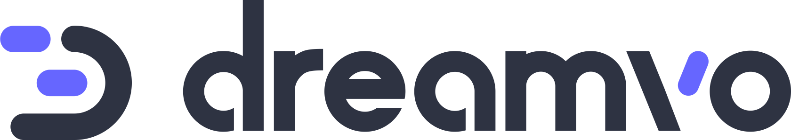
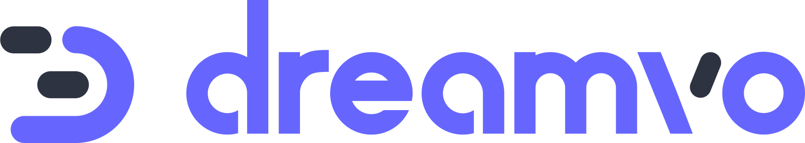

  
  

# logo

A beautiful logo for the Dreamvo project, made by [Quentin Lenglin](https://github.com/unneqit).

## Brand guidelines

See [guidelines.pdf](./guidelines.pdf).

## Fonts

- [Nunito](https://fonts.google.com/specimen/Nunito)
- [Open Sans](https://fonts.google.com/specimen/Open+Sans)

## Colors

- Light blue `#66f`
- Dark blue `#34495e`
- White `#ffffff`

### Backgrounds

- Light `#ffffff`
- Dark `#212121`
- Dark blue `#2e3341`

----

  
  
  

